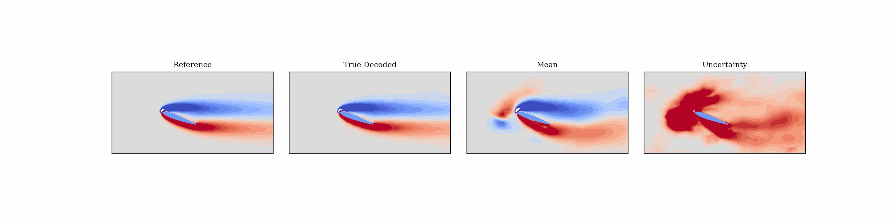

# Latent_DA_Aero

A machine-learning tool to sequentially estimate the strongly disturbed aerodynamic states using sparse noisy pressure measurements. This code levereges data assimilation in a reduced state space to make estimation fast and efficient potentially for real-time applications. Although the attached code is tailored to our paper [Sequential estimation of disturbed aerodynamic flows from sparse measurements via a reduced latent space](https://arxiv.org/abs/2509.03795)---where vorticity snapshots and lift coefficients serve as the flow states and pressure measurements as the observations, with an autoencoder used for dimensionality reduction---it can be readily applied to data assimilation in any reduced space, provided that a mapping from the reduced space to the original physical space is available. Only minor modifications are required in such cases.

For filtering problems, we specifically need a **forecast operator** that evolves the underlying flow states as well as an **observation operator** to map states to the corresponding observations. In a reduced space, these two models need to be learned. 

## Steps to execute the workflow
Follow the steps below in the specified order to execute the workflow:
1. Extract/learn a reduced state space (here by training a physics-augmented autoencoder):
Run the file `autoencoder.py` to train an autoencoder that extracts the underlying latent variables from data. These latent variables represent the reduced-order features of the vorticity field and lift coefficient while containing information about pressure observations as well. The observation operator is simultaneouly learned within the autoencoder.
2. Learn a dynamical model in the reduced latent space:
Run `dynamics.py` to train a Neural ODE that models the latent dynamics. The angle of attack, encoded as an additional input, augments the latent states, which are then advanced through the learned Markovian dynamics. This file also estimates the process noise as the empirical covariance of the residuals.
3. Perform data assimilation in the learned reduced space:
Run `enkf_DA.py` to apply the stochastic Ensemble Kalman Filter (sEnKF) for state estimation. The posterior samples can then be fed to the pre-trained decoder to reconstruct samples in the physical space, e.g. vorticity and lift. To compute Gramians, one can instead run `lrenkf` function. The filter implementation is provided in `LREnKF.py`.
4. Find the dominant correction directions during the analysis step of filtering through eigendecomposition of the computed Gramians, by running `gramians.py`.
